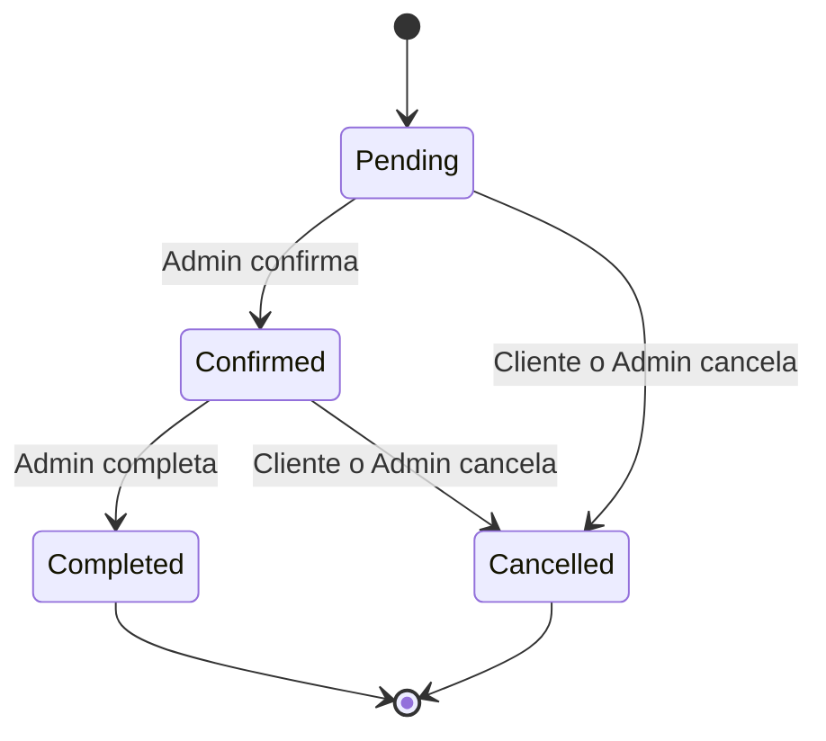

# VetCare — Reglas de negocio

> **Estado:** Aprobado para la versión 1  
> **Versión del documento:** 1.0

## 1. Propósito

Este documento define las reglas que deben cumplirse independientemente del endpoint o mecanismo técnico utilizado. Las reglas se implementarán principalmente en los servicios de aplicación y se cubrirán con pruebas automatizadas.

## 2. Principios generales

1. Los endpoints reciben peticiones, validan el formato básico, invocan servicios y transforman resultados en respuestas HTTP.
2. La lógica de negocio no se implementa en los endpoints.
3. La identidad del propietario se obtiene del JWT; nunca se confía en un `OwnerId` proporcionado por el cliente.
4. Los recursos históricos no se eliminan físicamente.
5. Las fechas y horas de citas se procesan y almacenan en UTC.
6. Los errores de negocio se convierten a Problem Details consistentes.

## 3. Reglas de autenticación

| ID | Regla |
|---|---|
| `RN-AUTH-01` | El correo electrónico debe ser válido y único. |
| `RN-AUTH-02` | Todo registro público recibe el rol `Customer`. |
| `RN-AUTH-03` | Un usuario no puede asignarse el rol `Admin` desde una petición pública. |
| `RN-AUTH-04` | La contraseña debe cumplir la política configurada de Identity. |
| `RN-AUTH-05` | Un login inválido devuelve `401 Unauthorized`. |
| `RN-AUTH-06` | La respuesta de login no revela si falló el correo o la contraseña. |
| `RN-AUTH-07` | Contraseñas, hashes, JWT y claves secretas nunca se incluyen en logs. |
| `RN-AUTH-08` | Un token expirado, mal firmado o con emisor/audiencia inválidos se rechaza. |

### 3.1 Política inicial de contraseña

- Longitud mínima: 8 caracteres.
- Requiere mayúscula: sí.
- Requiere minúscula: sí.
- Requiere número: sí.
- Requiere carácter especial: sí.

## 4. Reglas de mascotas

| ID | Regla |
|---|---|
| `RN-PET-01` | El nombre de la mascota es obligatorio. |
| `RN-PET-02` | El nombre, una vez normalizado, no puede quedar vacío. |
| `RN-PET-03` | La fecha de nacimiento no puede estar en el futuro. |
| `RN-PET-04` | El peso, cuando se envíe, debe ser mayor que cero y estar dentro del límite admitido. |
| `RN-PET-05` | El propietario se obtiene del claim `sub` del JWT. |
| `RN-PET-06` | El cliente no puede enviar ni modificar `OwnerId`. |
| `RN-PET-07` | Un cliente solo puede consultar y modificar sus propias mascotas. |
| `RN-PET-08` | Una mascota inactiva no puede utilizarse para crear nuevas citas. |
| `RN-PET-09` | No se puede desactivar una mascota que tenga citas futuras en estado `Pending` o `Confirmed`. |
| `RN-PET-10` | La eliminación de una mascota es lógica: `IsActive = false`. |
| `RN-PET-11` | La solicitud de una mascota inexistente o ajena devuelve `404 Not Found`. |
| `RN-PET-12` | Desactivar una mascota no elimina sus citas históricas. |
| `RN-PET-13` | `PetSpecies.Unknown` no se acepta al crear o actualizar una mascota. |

## 5. Reglas de servicios veterinarios

| ID | Regla |
|---|---|
| `RN-SVC-01` | Solo un usuario con rol `Admin` puede crear servicios. |
| `RN-SVC-02` | Solo un usuario con rol `Admin` puede actualizar servicios. |
| `RN-SVC-03` | Solo un usuario con rol `Admin` puede desactivar servicios. |
| `RN-SVC-04` | El nombre del servicio es obligatorio. |
| `RN-SVC-05` | El nombre debe ser único sin distinguir mayúsculas/minúsculas según la colación configurada. |
| `RN-SVC-06` | La descripción es obligatoria y debe respetar la longitud máxima. |
| `RN-SVC-07` | El precio debe ser mayor o igual que cero. |
| `RN-SVC-08` | La duración debe estar entre 15 y 240 minutos. |
| `RN-SVC-09` | Un servicio inactivo no puede utilizarse para crear nuevas citas. |
| `RN-SVC-10` | La eliminación de un servicio es lógica: `IsActive = false`. |
| `RN-SVC-11` | Desactivar un servicio no modifica ni elimina citas históricas. |
| `RN-SVC-12` | Las consultas públicas solo muestran servicios activos. |

## 6. Reglas de citas

| ID | Regla |
|---|---|
| `RN-APT-01` | La mascota debe existir y estar activa. |
| `RN-APT-02` | La mascota debe pertenecer al usuario autenticado que crea o modifica la cita. |
| `RN-APT-03` | El servicio debe existir y estar activo. |
| `RN-APT-04` | La fecha y hora inicial deben estar en el futuro con respecto al reloj del servidor. |
| `RN-APT-05` | La hora final se calcula como `ScheduledStartUtc + DurationMinutes`. |
| `RN-APT-06` | El cliente no puede enviar la hora final, el precio ni el estado inicial. |
| `RN-APT-07` | Una cita nueva se crea con estado `Pending`. |
| `RN-APT-08` | No pueden existir citas activas con horarios superpuestos. |
| `RN-APT-09` | Para conflictos se consideran las citas `Pending` y `Confirmed`. |
| `RN-APT-10` | Las citas `Cancelled` y `Completed` no bloquean nuevos horarios. |
| `RN-APT-11` | El precio de la cita se copia desde el servicio al momento de reservar. |
| `RN-APT-12` | Cambios posteriores en el precio del servicio no alteran citas existentes. |
| `RN-APT-13` | Solo citas `Pending` o `Confirmed` pueden reprogramarse. |
| `RN-APT-14` | Solo citas `Pending` o `Confirmed` pueden cancelarse. |
| `RN-APT-15` | Una cita `Completed` no puede reprogramarse ni cancelarse. |
| `RN-APT-16` | Una cita `Cancelled` no puede reactivarse. |
| `RN-APT-17` | Solo un administrador puede confirmar o completar una cita. |
| `RN-APT-18` | El cliente solo puede cancelar o reprogramar sus propias citas. |
| `RN-APT-19` | Las citas no se eliminan físicamente. |
| `RN-APT-20` | Al cancelar una cita se registra un motivo cuando la operación lo requiera. |
| `RN-APT-21` | El administrador puede consultar todas las citas; el cliente solo las asociadas a sus mascotas. |
| `RN-APT-22` | En VetCare v1 la clínica dispone de una única capacidad de atención simultánea. |

## 7. Detección de superposición

Dos intervalos se superponen cuando se cumple:

```text
nuevoInicio < citaExistenteFin
AND
citaExistenteInicio < nuevoFin
```

### 7.1 Ejemplos

| Cita existente | Nueva cita | Resultado |
|---|---|---|
| 10:00–10:30 | 10:15–10:45 | Conflicto |
| 10:00–10:30 | 09:45–10:15 | Conflicto |
| 10:00–10:30 | 10:00–10:30 | Conflicto |
| 10:00–10:30 | 10:30–11:00 | Permitida |
| 10:00–10:30 | 09:30–10:00 | Permitida |

Al reprogramar, la consulta de conflictos debe excluir la propia cita que se está modificando.

## 8. Estados de una cita

```text
Pending
Confirmed
Completed
Cancelled
```

### 8.1 Transiciones permitidas

| Estado actual | Estado siguiente permitido | Actor autorizado |
|---|---|---|
| `Pending` | `Confirmed` | Admin |
| `Pending` | `Cancelled` | Propietario o Admin |
| `Confirmed` | `Completed` | Admin |
| `Confirmed` | `Cancelled` | Propietario o Admin |
| `Completed` | Ninguno | — |
| `Cancelled` | Ninguno | — |

### 8.2 Diagrama de estados



## 9. Reglas de propiedad y ocultamiento de recursos

1. Un cliente autenticado no debe poder descubrir si existe una mascota o cita de otro cliente.
2. Las operaciones sobre un recurso inexistente o ajeno devuelven el mismo resultado: `404 Not Found`.
3. La verificación de propiedad se realiza en la capa de aplicación o mediante consultas que incluyan el identificador del propietario.
4. El identificador del usuario nunca se toma del cuerpo de la petición.

## 10. Reglas de paginación y ordenamiento

| ID | Regla |
|---|---|
| `RN-PAGE-01` | `pageNumber` empieza en 1. |
| `RN-PAGE-02` | `pageSize` tiene valor predeterminado 10. |
| `RN-PAGE-03` | `pageSize` no puede superar 100. |
| `RN-PAGE-04` | Valores inválidos devuelven `400 Bad Request`. |
| `RN-PAGE-05` | El ordenamiento solo acepta campos incluidos en una lista segura. |
| `RN-PAGE-06` | Toda consulta paginada usa un orden completamente estable, agregando `Id` como desempate. |

## 11. Reglas monetarias

1. Los importes se representan con `decimal` en .NET.
2. SQL Server almacena los importes como `decimal(10,2)`.
3. No se utilizan `float` ni `double` para precios.
4. El precio histórico se almacena en la cita.
5. La moneda de VetCare v1 será una decisión de presentación/configuración; el valor persistido no incluirá conversiones automáticas.

## 12. Reglas de tiempo

1. La API recibe fechas y horas de citas en ISO 8601 con indicador UTC, por ejemplo `2026-10-05T15:00:00Z`.
2. La persistencia utiliza UTC.
3. Las conversiones a hora local corresponden al frontend.
4. Las reglas dependientes del tiempo utilizarán `TimeProvider`, lo que permitirá pruebas deterministas.

## 13. Resultado HTTP de reglas principales

| Situación | Código HTTP | Código interno sugerido |
|---|---:|---|
| Datos de entrada inválidos | 400 | `VALIDATION_ERROR` |
| Credenciales inválidas | 401 | `INVALID_CREDENTIALS` |
| Rol insuficiente | 403 | `FORBIDDEN` |
| Recurso inexistente o ajeno | 404 | `RESOURCE_NOT_FOUND` |
| Correo duplicado | 409 | `EMAIL_ALREADY_EXISTS` |
| Nombre de servicio duplicado | 409 | `SERVICE_NAME_ALREADY_EXISTS` |
| Horario ocupado | 409 | `APPOINTMENT_TIME_CONFLICT` |
| Transición inválida | 409 | `APPOINTMENT_INVALID_STATUS_TRANSITION` |
| Mascota con citas futuras | 409 | `PET_HAS_ACTIVE_APPOINTMENTS` |

## 14. Referencias relacionadas

- [Requisitos](02-functional-requirements.md)
- [Modelo de datos](04-data-model.md)
- [Contrato de API](05-api-contract.md)
- [Plan de pruebas](07-test-plan.md)
