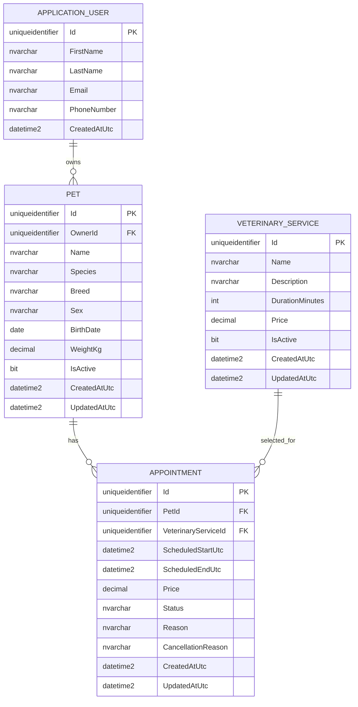

# VetCare — Modelo de datos

> **Estado:** Aprobado para la versión 1  
> **Versión del documento:** 1.0  
> **Proveedor previsto:** SQL Server / Azure SQL Database

## 1. Propósito

Este documento define las entidades, propiedades, relaciones, restricciones e índices previstos para VetCare v1. El modelo se implementará con Entity Framework Core y SQL Server.

## 2. Entidades principales

VetCare v1 utiliza cuatro entidades principales:

- `ApplicationUser`: usuario administrado por ASP.NET Core Identity.
- `Pet`: mascota perteneciente a un cliente.
- `VeterinaryService`: servicio ofrecido por la clínica.
- `Appointment`: reserva de un servicio para una mascota.

Las tablas internas de Identity también formarán parte de la base de datos, pero no representan entidades funcionales propias de VetCare.

## 3. Diagrama entidad-relación



## 4. `ApplicationUser`

`ApplicationUser` heredará de:

```csharp
IdentityUser<Guid>
```

Identity proporcionará, entre otras, las propiedades `Id`, `UserName`, `NormalizedUserName`, `Email`, `NormalizedEmail`, `PasswordHash`, `PhoneNumber`, `SecurityStamp` y `ConcurrencyStamp`.

### 4.1 Propiedades adicionales

| Propiedad | Tipo .NET | SQL previsto | Obligatoria | Restricción |
|---|---|---|:---:|---|
| `Id` | `Guid` | `uniqueidentifier` | Sí | Clave primaria. |
| `FirstName` | `string` | `nvarchar(100)` | Sí | Entre 1 y 100 caracteres. |
| `LastName` | `string` | `nvarchar(100)` | Sí | Entre 1 y 100 caracteres. |
| `Email` | `string` | `nvarchar(256)` | Sí | Administrado y normalizado por Identity. |
| `PhoneNumber` | `string?` | `nvarchar(max)` o longitud configurada | No | Propiedad heredada de Identity. |
| `CreatedAtUtc` | `DateTime` | `datetime2` | Sí | Fecha UTC de registro. |

### 4.2 Consideraciones

- El correo será el nombre de usuario de acceso.
- La unicidad se controlará mediante Identity y sus índices normalizados.
- Los roles se almacenarán en las tablas de Identity.
- El registro público asignará el rol `Customer`.

## 5. `Pet`

Representa una mascota registrada por un cliente.

| Propiedad | Tipo .NET | SQL previsto | Obligatoria | Restricción |
|---|---|---|:---:|---|
| `Id` | `Guid` | `uniqueidentifier` | Sí | Clave primaria. |
| `OwnerId` | `Guid` | `uniqueidentifier` | Sí | FK a `ApplicationUser.Id`. |
| `Name` | `string` | `nvarchar(100)` | Sí | Entre 1 y 100 caracteres. |
| `Species` | `PetSpecies` | `nvarchar(30)` | Sí | Enum almacenado como texto. |
| `Breed` | `string?` | `nvarchar(100)` | No | Máximo 100 caracteres. |
| `Sex` | `PetSex` | `nvarchar(20)` | Sí | Enum almacenado como texto. |
| `BirthDate` | `DateOnly?` | `date` | No | No puede estar en el futuro. |
| `WeightKg` | `decimal?` | `decimal(6,2)` | No | Mayor que 0 y máximo funcional de 200 kg. |
| `IsActive` | `bool` | `bit` | Sí | Valor inicial `true`. |
| `CreatedAtUtc` | `DateTime` | `datetime2` | Sí | Fecha UTC de creación. |
| `UpdatedAtUtc` | `DateTime?` | `datetime2` | No | Última modificación UTC. |

### 5.1 Enumeración `PetSpecies`

```text
Dog
Cat
Bird
Rabbit
Other
```

### 5.2 Enumeración `PetSex`

```text
Male
Female
Unknown
```

### 5.3 Relación

```text
ApplicationUser 1 ─────── N Pet
```

Un usuario puede tener muchas mascotas y cada mascota pertenece a un único usuario.

## 6. `VeterinaryService`

Representa un servicio ofrecido por la clínica.

| Propiedad | Tipo .NET | SQL previsto | Obligatoria | Restricción |
|---|---|---|:---:|---|
| `Id` | `Guid` | `uniqueidentifier` | Sí | Clave primaria. |
| `Name` | `string` | `nvarchar(150)` | Sí | Único; máximo 150 caracteres. |
| `Description` | `string` | `nvarchar(1000)` | Sí | Máximo 1000 caracteres. |
| `DurationMinutes` | `int` | `int` | Sí | Entre 15 y 240. |
| `Price` | `decimal` | `decimal(10,2)` | Sí | Mayor o igual que 0. |
| `IsActive` | `bool` | `bit` | Sí | Valor inicial `true`. |
| `CreatedAtUtc` | `DateTime` | `datetime2` | Sí | Fecha UTC de creación. |
| `UpdatedAtUtc` | `DateTime?` | `datetime2` | No | Última modificación UTC. |

### 6.1 Relación

```text
VeterinaryService 1 ───── N Appointment
```

Un servicio puede estar relacionado con muchas citas. El servicio no se elimina físicamente cuando tiene historial.

## 7. `Appointment`

Representa una reserva de atención veterinaria.

| Propiedad | Tipo .NET | SQL previsto | Obligatoria | Restricción |
|---|---|---|:---:|---|
| `Id` | `Guid` | `uniqueidentifier` | Sí | Clave primaria. |
| `PetId` | `Guid` | `uniqueidentifier` | Sí | FK a `Pet.Id`. |
| `VeterinaryServiceId` | `Guid` | `uniqueidentifier` | Sí | FK a `VeterinaryService.Id`. |
| `ScheduledStartUtc` | `DateTime` | `datetime2` | Sí | Inicio UTC. |
| `ScheduledEndUtc` | `DateTime` | `datetime2` | Sí | Debe ser posterior al inicio. |
| `Price` | `decimal` | `decimal(10,2)` | Sí | Copia histórica del precio. |
| `Status` | `AppointmentStatus` | `nvarchar(20)` | Sí | Enum almacenado como texto. |
| `Reason` | `string` | `nvarchar(500)` | Sí | Entre 1 y 500 caracteres. |
| `CancellationReason` | `string?` | `nvarchar(500)` | No | Motivo de cancelación. |
| `CreatedAtUtc` | `DateTime` | `datetime2` | Sí | Fecha UTC de creación. |
| `UpdatedAtUtc` | `DateTime?` | `datetime2` | No | Última modificación UTC. |

### 7.1 Enumeración `AppointmentStatus`

```text
Pending
Confirmed
Completed
Cancelled
```

### 7.2 Relaciones

```text
Pet 1 ─────────────────── N Appointment
VeterinaryService 1 ───── N Appointment
```

Cada cita pertenece a una mascota y utiliza un servicio veterinario.

### 7.3 Precio histórico

Al crear una cita:

```text
Appointment.Price = VeterinaryService.Price
```

Esto evita que una modificación posterior del catálogo cambie el precio asociado a una reserva existente.

### 7.4 Fin calculado

El cliente envía únicamente el inicio. La aplicación calcula:

```text
ScheduledEndUtc = ScheduledStartUtc + DurationMinutes
```

## 8. Claves y generación de identificadores

- Todas las entidades funcionales utilizan `Guid`.
- Los identificadores se generan en la aplicación.
- Los clientes nunca determinan el identificador del propietario.
- Los identificadores se exponen en la API como cadenas UUID estándar.

## 9. Comportamiento de eliminación

| Relación | Comportamiento EF/SQL | Motivo |
|---|---|---|
| Usuario → Mascotas | `Restrict` / `NoAction` | Evitar pérdida accidental de mascotas e historial. |
| Mascota → Citas | `Restrict` / `NoAction` | Conservar citas históricas. |
| Servicio → Citas | `Restrict` / `NoAction` | Conservar el servicio relacionado con citas históricas. |

La aplicación utiliza eliminación lógica:

- `Pet.IsActive = false`.
- `VeterinaryService.IsActive = false`.
- Las citas se cancelan mediante `Status = Cancelled`.

## 10. Índices previstos

| Tabla | Índice | Tipo / finalidad |
|---|---|---|
| `Pets` | `OwnerId` | Acelera consultas por propietario. |
| `Pets` | `(OwnerId, IsActive)` | Acelera listados de mascotas activas. |
| `Pets` | `(OwnerId, Name, Id)` | Apoya búsqueda/ordenamiento estable. |
| `VeterinaryServices` | `Name` | Único; evita duplicados. |
| `VeterinaryServices` | `(IsActive, Name, Id)` | Catálogo público paginado. |
| `Appointments` | `PetId` | Consultas por mascota. |
| `Appointments` | `VeterinaryServiceId` | Consultas por servicio. |
| `Appointments` | `ScheduledStartUtc` | Consultas por fecha y conflictos. |
| `Appointments` | `(Status, ScheduledStartUtc, Id)` | Filtros y paginación administrativa. |
| `Appointments` | `(PetId, ScheduledStartUtc, Id)` | Historial de una mascota. |

## 11. Restricciones de base de datos previstas

Además de las validaciones de aplicación, se evaluarán restricciones SQL equivalentes:

- `VeterinaryService.Price >= 0`.
- `VeterinaryService.DurationMinutes BETWEEN 15 AND 240`.
- `Pet.WeightKg IS NULL OR Pet.WeightKg > 0`.
- `Appointment.Price >= 0`.
- `Appointment.ScheduledEndUtc > Appointment.ScheduledStartUtc`.

La superposición de citas se valida en la capa de aplicación dentro de la operación de reserva. No se expresa como una restricción simple de tabla.

## 12. Auditoría básica

Las entidades funcionales incluyen:

```text
CreatedAtUtc
UpdatedAtUtc
```

Reglas:

- `CreatedAtUtc` se establece una sola vez.
- `UpdatedAtUtc` se actualiza en cada modificación.
- Los valores se obtienen mediante `TimeProvider`.
- VetCare v1 no incluye auditoría histórica completa por campo.

## 13. Datos iniciales

El inicializador de base de datos creará de forma idempotente:

### 13.1 Roles

```text
Admin
Customer
```

### 13.2 Administrador inicial

Los valores se obtienen desde secretos o variables de entorno:

```text
SeedAdmin:Email
SeedAdmin:Password
SeedAdmin:FirstName
SeedAdmin:LastName
```

### 13.3 Servicios iniciales sugeridos

- Consulta general.
- Vacunación.
- Desparasitación.
- Control preventivo.

Los precios y duraciones definitivos se establecerán en la implementación del seed.

## 14. Contexto de Entity Framework Core

Se utilizará un único contexto:

```text
VetCareDbContext
```

Heredará conceptualmente de:

```csharp
IdentityDbContext<ApplicationUser, IdentityRole<Guid>, Guid>
```

Incluirá:

```csharp
DbSet<Pet> Pets
DbSet<VeterinaryService> VeterinaryServices
DbSet<Appointment> Appointments
```

## 15. Migraciones

- Las migraciones pertenecerán a `VetCare.Infrastructure`.
- SQL Server será el proveedor oficial de las migraciones.
- No se mantendrán migraciones paralelas para SQLite.
- La creación o actualización automática de esquema en producción se evaluará con cuidado; el despliegue debe conservar trazabilidad.

## 16. Consideraciones futuras

No forman parte de VetCare v1:

- Entidad `Veterinarian`.
- Disponibilidad por profesional.
- Entidad `ClinicBranch`.
- Historias clínicas.
- Vacunas y tratamientos.
- Control de concurrencia mediante `rowversion` en todos los agregados.
- Auditoría histórica completa.

## 17. Referencias relacionadas

- [Reglas de negocio](03-business-rules.md)
- [Contrato de API](05-api-contract.md)
- [ADR-002: Base de datos](decisions/ADR-002-database.md)
- [ADR-004: Eliminación lógica](decisions/ADR-004-deletion-strategy.md)
