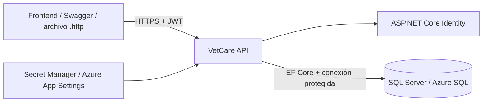

# VetCare — Modelo de seguridad

> **Estado:** Aprobado para la versión 1  
> **Versión del documento:** 1.0

## 1. Objetivo

Definir cómo VetCare autentica usuarios, autoriza operaciones, protege secretos, limita la exposición de datos y evita que un cliente acceda a recursos ajenos.

## 2. Límites de confianza



Principios:

- Todo tráfico productivo utiliza HTTPS.
- El cliente nunca se conecta directamente a la base de datos.
- La API es la única responsable de aplicar autenticación, autorización y reglas de propiedad.
- Los secretos no se incluyen en el repositorio.

## 3. Autenticación con ASP.NET Core Identity

Identity administrará:

- Usuarios.
- Hashes de contraseña.
- Normalización de correo.
- Roles.
- Sellos de seguridad.
- Reglas de contraseña.
- Posible bloqueo futuro.

`ApplicationUser` heredará de `IdentityUser<Guid>`.

## 4. Política de contraseña inicial

```text
Longitud mínima: 8
Mayúscula requerida: Sí
Minúscula requerida: Sí
Número requerido: Sí
Carácter especial requerido: Sí
```

La contraseña nunca se devuelve, se registra en logs ni se guarda como texto plano.

## 5. JWT Bearer

Después de validar las credenciales, VetCare emitirá un JWT estándar firmado.

### 5.1 Claims

| Claim | Contenido |
|---|---|
| `sub` | Identificador `Guid` del usuario. |
| `email` | Correo del usuario. |
| `role` | Uno o más roles. |
| `jti` | Identificador único del token. |
| `iat` | Fecha de emisión. |
| `exp` | Fecha de expiración. |
| `iss` | Emisor esperado. |
| `aud` | Audiencia esperada. |

### 5.2 Validaciones obligatorias

La autenticación JwtBearer validará:

- Firma.
- Clave de firma.
- Emisor.
- Audiencia.
- Fecha de expiración.
- Formato del token.

### 5.3 Duración inicial

```text
Access token: 60 minutos
```

Los refresh tokens están fuera del alcance de VetCare v1.

### 5.4 Datos que no deben incluirse

- Contraseña o hash.
- Información clínica.
- Datos completos de mascotas.
- Claves de configuración.
- Cadena de conexión.
- Datos sensibles no necesarios para autorización.

## 6. Roles

```text
Customer
Admin
```

### 6.1 Asignación

- El registro público asigna únicamente `Customer`.
- El cliente no puede enviar un rol en la petición de registro.
- El rol `Admin` se asigna mediante seed o un proceso administrativo seguro.

## 7. Políticas

| Política | Regla |
|---|---|
| `AuthenticatedUser` | Requiere un usuario autenticado. |
| `AdminOnly` | Requiere el rol `Admin`. |

Los grupos de Minimal APIs aplicarán `.RequireAuthorization()` o `.RequireAuthorization("AdminOnly")` según corresponda.

### Política CustomerOnly

`CustomerOnly` requiere:

- Usuario autenticado.
- Rol `Customer`.

Se utiliza en los endpoints `/api/v1/pets`.

### Autorización a nivel de recurso

La autorización de mascotas también se valida por propiedad.

El `OwnerId` se obtiene desde el claim `sub` del JWT a través de
`ICurrentUser`.

Las consultas al repositorio utilizan simultáneamente:

- `PetId`
- `OwnerId`

Una mascota perteneciente a otro usuario se responde como
`404 Not Found` y no como `403 Forbidden`, evitando revelar la
existencia del recurso.

### Servicios veterinarios

La consulta del catálogo de servicios activos es pública y no requiere
JWT.

Las siguientes operaciones requieren la política `AdminOnly`:

- Crear servicio veterinario.
- Actualizar servicio veterinario.
- Desactivar servicio veterinario.
- Consultar el catálogo administrativo.

Un usuario autenticado con rol `Customer` recibe `403 Forbidden` al
intentar ejecutar operaciones administrativas.

## 8. Autorización por propiedad

La autenticación responde **quién es el usuario**; la autorización por propiedad responde **si puede operar sobre ese recurso concreto**.

Reglas:

1. El servicio obtiene el identificador del usuario desde `sub`.
2. Los endpoints de cliente no aceptan `OwnerId`.
3. La consulta de mascotas incluye `OwnerId == currentUserId`.
4. La consulta de citas de cliente verifica que la mascota pertenece al usuario.
5. Un recurso ajeno se trata como no encontrado.
6. El administrador no se convierte automáticamente en propietario de una mascota.

## 9. Matriz de autorización

| Operación | Público | Customer | Admin |
|---|:---:|:---:|:---:|
| Registro | Sí | Sí | Sí |
| Login | Sí | Sí | Sí |
| Consultar servicios activos | Sí | Sí | Sí |
| Consultar usuario actual | No | Sí | Sí |
| CRUD de mascota propia | No | Sí | No automáticamente |
| Crear cita para mascota propia | No | Sí | No como cliente |
| Consultar cita propia | No | Sí | Sí mediante acceso administrativo |
| Consultar todas las citas | No | No | Sí |
| Crear/editar/desactivar servicios | No | No | Sí |
| Confirmar/completar cita | No | No | Sí |

## 10. Respuestas de seguridad

| Situación | Respuesta |
|---|---|
| No se envía token | `401 Unauthorized` |
| Token inválido o expirado | `401 Unauthorized` |
| Credenciales incorrectas | `401 Unauthorized` |
| Customer intenta una acción Admin | `403 Forbidden` |
| Usuario solicita recurso ajeno | `404 Not Found` |
| Recurso inexistente | `404 Not Found` |

El uso de `404` para recursos ajenos reduce la filtración de información sobre su existencia.

## 11. Gestión de secretos

### 11.1 Desarrollo local

Se utilizará Secret Manager o variables de entorno para:

```text
ConnectionStrings:DefaultConnection
Jwt:Key
SeedAdmin:Email
SeedAdmin:Password
SeedAdmin:FirstName
SeedAdmin:LastName
```

### 11.2 Docker

- Variables de entorno.
- Archivo `.env` local no versionado.
- Archivo `.env.example` sin valores reales.

### 11.3 Azure

Se utilizarán Application Settings o una integración futura con Key Vault:

```text
ConnectionStrings__DefaultConnection
Jwt__Issuer
Jwt__Audience
Jwt__Key
Jwt__ExpirationMinutes
SeedAdmin__Email
SeedAdmin__Password
```

## 12. CORS

Se definirá una política nombrada, por ejemplo `Frontend`.

Los orígenes permitidos provendrán de configuración:

```json
{
  "Cors": {
    "AllowedOrigins": [
      "http://localhost:4200",
      "http://localhost:5173"
    ]
  }
}
```

Reglas:

- No utilizar `AllowAnyOrigin` en producción.
- Permitir únicamente métodos y encabezados necesarios.
- Actualizar la lista cuando exista el frontend real.
- CORS no reemplaza autenticación ni autorización.

## 13. HTTPS

En producción:

- Se exigirá HTTPS.
- Los tokens no se transmitirán por HTTP plano.
- Azure redirigirá o bloqueará tráfico inseguro.
- El cliente no almacenará el token en URLs ni logs.

## 14. Seguridad de base de datos

- La API utilizará una cuenta con los permisos mínimos necesarios.
- La cadena de conexión no se versionará.
- La base de datos no será accesible públicamente sin restricciones.
- En Azure se configurarán reglas de red apropiadas.
- Las copias de seguridad y restauración dependerán de Azure SQL Database.
- EF Core utilizará consultas parametrizadas; no se concatenarán valores del usuario en SQL.

## 15. Protección de logs

No se registrarán:

- Contraseñas.
- Hashes.
- Tokens completos.
- Claves JWT.
- Cadenas de conexión.
- Cabeceras `Authorization`.
- Cuerpos completos de login o registro.

Sí pueden registrarse, cuando sean necesarios:

- Identificadores de usuario y recurso.
- Tipo de operación.
- Estado anterior y nuevo.
- Fechas de negocio.
- `TraceId`.

## 16. Manejo seguro de errores

- Los errores inesperados no devuelven stack trace.
- Los mensajes internos de SQL Server no llegan al cliente.
- Problem Details incluye un mensaje seguro y un `traceId`.
- Los detalles técnicos completos se registran únicamente en el servidor.
- Los errores de login no indican si el correo existe.

## 17. OpenAPI y Swagger

- Swagger declarará el esquema Bearer.
- La interfaz permitirá introducir temporalmente un JWT para pruebas.
- La disponibilidad en producción se controlará mediante configuración.
- La documentación no incluirá secretos ni credenciales reales.

## 18. Datos personales

VetCare v1 almacena datos identificativos básicos del usuario y datos de sus mascotas. Se aplicarán los siguientes principios:

- Recopilar solo datos necesarios.
- No exponer datos de otros clientes.
- No incluir datos personales innecesarios en logs.
- Mantener los DTOs de respuesta limitados al caso de uso.
- No incluir información clínica sensible porque está fuera del alcance v1.

## 19. Riesgos y mitigaciones

| Riesgo | Mitigación prevista |
|---|---|
| Un cliente modifica una mascota ajena | Filtrado por `OwnerId` obtenido del JWT. |
| Escalación a Admin durante registro | El request no contiene roles; asignación fija `Customer`. |
| Robo de secretos desde GitHub | Secret Manager, variables de entorno y revisión antes del push. |
| Token alterado | Validación de firma, emisor, audiencia y expiración. |
| Inyección SQL | EF Core y consultas parametrizadas. |
| Exposición de stack trace | Manejador global y Problem Details seguro. |
| Exposición de token en logs | Exclusión explícita de cabeceras y cuerpos sensibles. |
| Acceso desde origen no autorizado | Política CORS configurada. |
| Fuerza bruta de login | Identity permite bloqueo; endurecimiento adicional queda como mejora. |

## 20. Lista de verificación de seguridad

```text
[ ] Registro no acepta roles.
[ ] Contraseñas se procesan únicamente mediante Identity.
[ ] JWT valida firma, issuer, audience y expiration.
[ ] Endpoints protegidos requieren autorización.
[ ] Endpoints Admin requieren la política AdminOnly.
[ ] Recursos del cliente se filtran por propietario.
[ ] Recursos ajenos devuelven 404.
[ ] No hay secretos en appsettings.json versionado.
[ ] No hay secretos en archivos .http.
[ ] No hay tokens ni contraseñas en logs.
[ ] CORS usa orígenes configurados.
[ ] Producción exige HTTPS.
[ ] Errores inesperados no exponen detalles internos.
[ ] Swagger no contiene credenciales reales.
```

## 21. Referencias relacionadas

- [Contrato de API](05-api-contract.md)
- [ADR-003: Identity y JWT](decisions/ADR-003-authentication.md)
- [Definición de terminado](09-definition-of-done.md)
